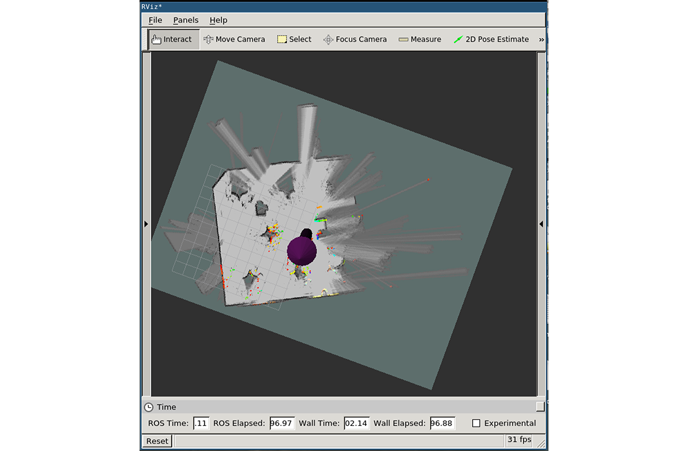

# Google Cartographer configuration files

These files are necessary to make Google Cartographer work on the RACECAR.

## Installation

1. Move racecar\_description to ~/cartographer\_ws/src
2. Move racecar\_2d.lua to ~/cartographer\_ws/src/cartographer\_ros/cartographer\_ros/configuration\_files/racecar\_2d.lua
3. Move racecar\_2d.launch to ~/cartographer\_ws/src/cartographer\_ros/cartographer\_ros/launch/racecar\_2d.launch
4. Build the cartographer workspace with: catkin\_make\_isolated --install --use-ninja

## Install script

```
cp racecar_2d.lua ~/cartographer_ws/src/cartographer_ros/cartographer_ros/configuration_files/racecar_2d.lua
cp racecar_2d.launch ~/cartographer_ws/src/cartographer_ros/cartographer_ros/launch/racecar_2d.launch
cp -r racecar_description ~/cartographer_ws/src/
cd ~/cartographer_ws
catkin_make_isolated --install --use-ninja
source ~/cartographer_ws/devel_isolated/setup.bash
```

## Run the launch file

```
source ~/cartographer_ws/devel_isolated/setup.bash
roslaunch racecar teleop.launch
roslaunch cartographer_ros racecar_2d.launch
```

## Open up the map in RViz

You should be able to see the map being built. You will have to drive around a bit for it to start doing interesting things.



## Tips

- Loop closures are very important! Make sure you drive the robot through loops when possible.
- Take a look at racecar_2d.lua: you can optimize various parameters for better results!
- http://google-cartographer-ros.readthedocs.io/en/latest/tuning.html

**NOTE:** When you run the build command, it creates copies of the launch and configuration files in a build directory! From then on, it will use those copies. Thus, **if you modify the originals without re-running the build command, your changes will not be picked up.** You can also directly edit the copies for faster tuning, see:
- ~/cartographer\_ws/install\_isolated/share/cartographer\_ros/configuration_files/racecar\_2d.lua
- ~/cartographer\_ws/install\_isolated/share/cartographer\_ros/launch/racecar\_2d.launch
